[中文](README.md) | English

# Private Diary

> A fully offline, calendar-style private tracker. Your data never leaves your device — no network, no account, no upload.

[](LICENSE)
[](#installation)
[](#privacy--data)
[](#configuration)

Private Diary records the frequency and type of each day in a calendar, and puts long-term trends,
trigger distribution, frequency reminders and self-set goals on a stats page.
It ships in two forms: a **PWA you install from your phone browser**, and an
**installable Android APK** (with real daily reminder notifications).

<p align="center">
  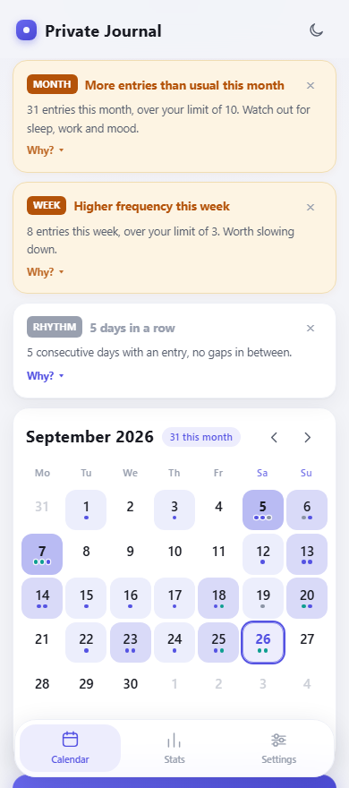
  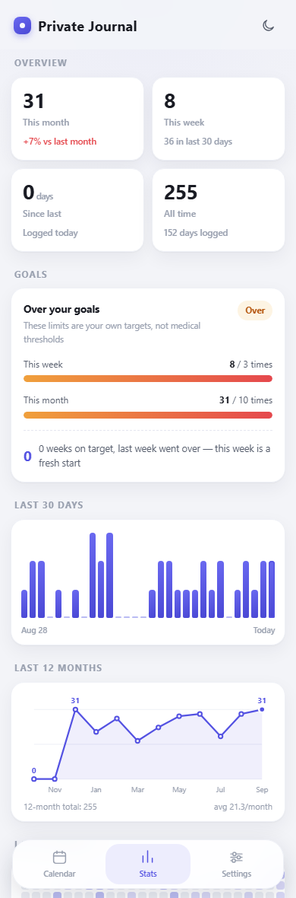
  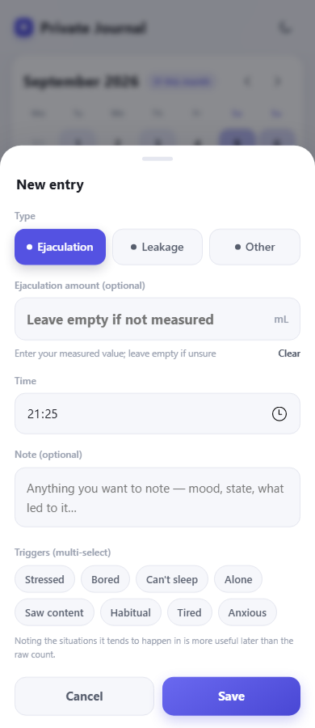
</p>

---

## ⚠️ Read this first

**This app is not medical advice and does not provide a health diagnosis.**

There is no established medical standard for "how many times per week or month is too many",
and the count itself is not a health indicator. Whether something is a problem usually comes
down to three things:

- Does it affect your sleep, work, study or mood?
- Do you want to stop but cannot?
- Is there physical discomfort (soreness, skin irritation)?

So the "weekly limit / monthly limit" in the app is positioned as **your own self-set goal**,
not a medical red line. The defaults are just a moderate starting point — adjust them freely.
The reminder copy is written the same way: state the fact and point somewhere useful,
rather than making a sweeping claim.

If you feel this is affecting your life, the person worth talking to is a doctor or a
counsellor — not an app.

---

## Features

### 📅 Calendar

- Month view, 42 cells, week can start on Monday or Sunday
- Each day is **shaded by frequency** (levels 1–4); more than 4 shows the number
- Small dots under each day are **coloured by type**, so you can see at a glance what happened
- Tap any date for that day's details; you can **backfill past dates**
- **Long-press any date** to log one immediately using the last used type — no form
- Mini stats: this month / this week / since last

### ✍️ Logging

Tap "Add entry" to open the form:

| Field | Notes |
|---|---|
| **Type** | Ejaculation / Leakage / Other, each with its own colour |
| **Amount** | Only shown for Ejaculation or Leakage, in mL. Leave empty if not measured; there's a Clear button |
| **Time** | Defaults to now, editable |
| **Note** | Free text |
| **Triggers** | Multi-select: Stressed, Bored, Can't sleep, Alone, Saw content, Habitual, Tired, Anxious |

The form **remembers the last type and tags**, so day-to-day logging is usually
"Add entry → Save". Deleting asks for confirmation, and an **Undo button appears in the
bottom toast for 6 seconds**.

### 📊 Stats

- **Overview**: this month (with month-over-month change), this week, since last, all time
- **Goals**: weekly/monthly progress bars, whether you're within your goals, and **consecutive weeks on target**
- **Last 30 days**: bar chart
- **Last 12 months**: line chart with area fill, marking the peak and the current month
- **Last 6 months**: 26-week × 7-day heatmap
- **By type** / **By trigger**: distribution with counts
- **Details**: 11 metrics grouped into Rhythm / Frequency & measurement / Timeline

### 🔔 Frequency reminders

When you go over a limit, a card appears at the top of the calendar. You can expand it for
details, or dismiss it **per period** (dismissing this week's won't silence next week's).

| Rule | Default | Level |
|---|---|---|
| Monthly entries over the monthly limit | 10 | Warning |
| Weekly entries over the weekly limit | 3 | Warning |
| Consecutive days with an entry | ≥ 3 days | Note |
| Late-night entries this month (0:00–5:00) | ≥ 3 | Note |

The last two are deliberate: **a streak** and **late-night sessions** say more about whether a
habit is slipping out of control than a monthly total, and sleep loss usually affects you
more than the count itself.

### ⏰ Daily check-in reminder

Turn it on in Settings and pick a time. The copy is deliberately written as a "self check-in"
rather than "time to log" — the point of this app is not to encourage you to do it more.

- **APK**: uses the system `AlarmManager` + notifications — **works when the app is closed**,
  and survives a reboot
- **Web**: no background capability, so it only fires while the page is open

### 🔒 Passcode lock

- 4-digit passcode required to open the app
- Stored as a **PBKDF2-SHA256** derivation (120,000 iterations + random salt) — never in plaintext
- **Locks after 5 consecutive failures**, starting at 30 seconds and doubling each time
  (up to ~32 minutes), with a live countdown
- Keypad buttons stay perfectly circular at any screen size or aspect ratio

### 🌐 Interface language

Full **English / 中文** support, switchable in Settings or left on "follow system".
The switch takes effect immediately — no reinstall, no reload.

<p align="center">
  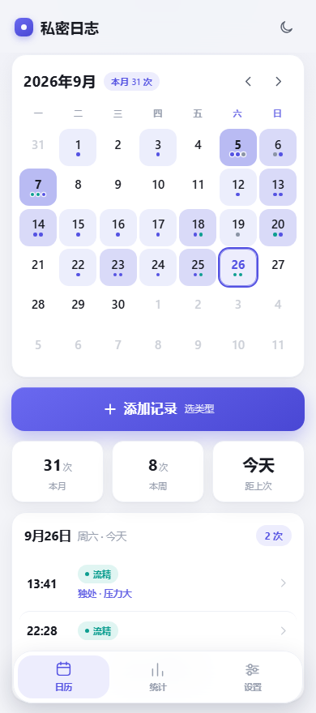
  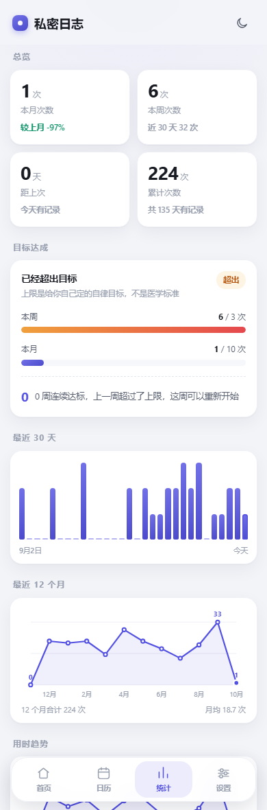
  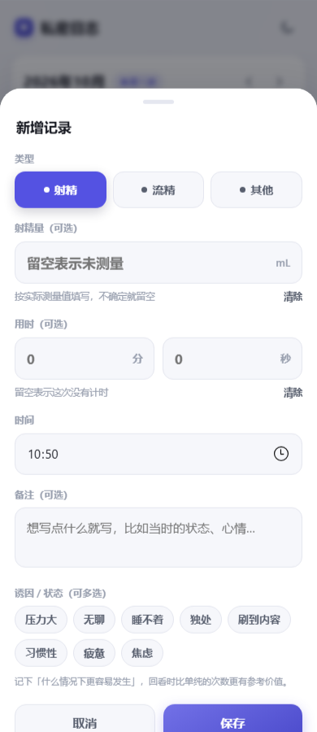
</p>

---

## Screenshots

| Calendar | Stats | Entry form | Dark theme |
|:---:|:---:|:---:|:---:|
|  |  |  | 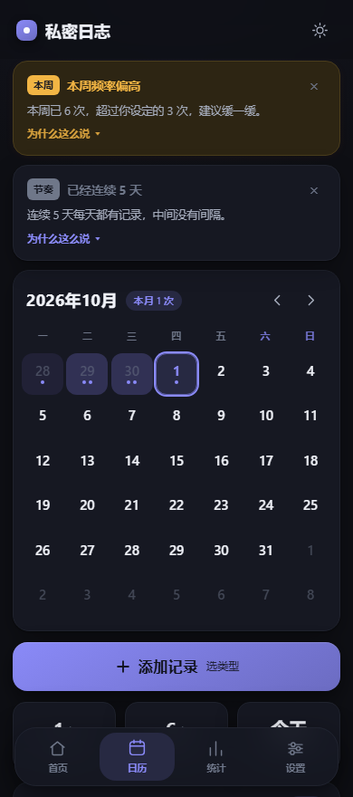 |

| Reminders | Settings | Passcode | Passcode (dark) |
|:---:|:---:|:---:|:---:|
| 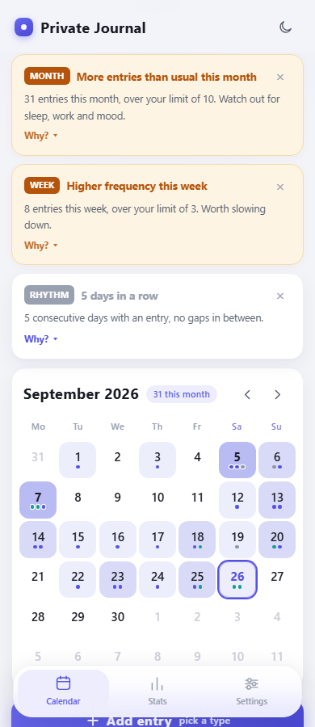 | 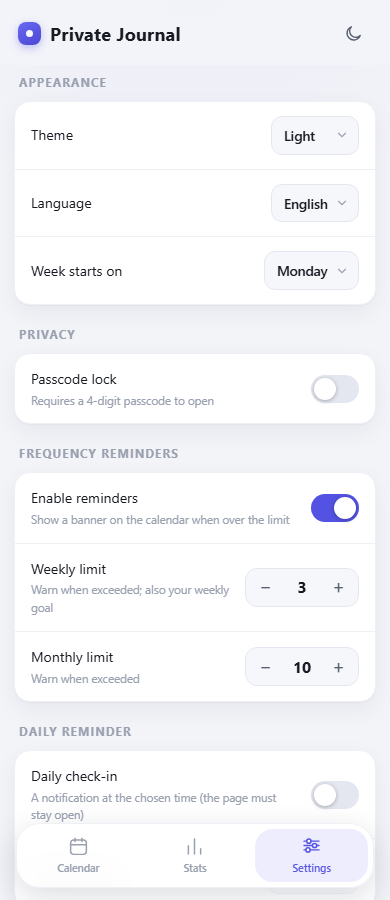 | 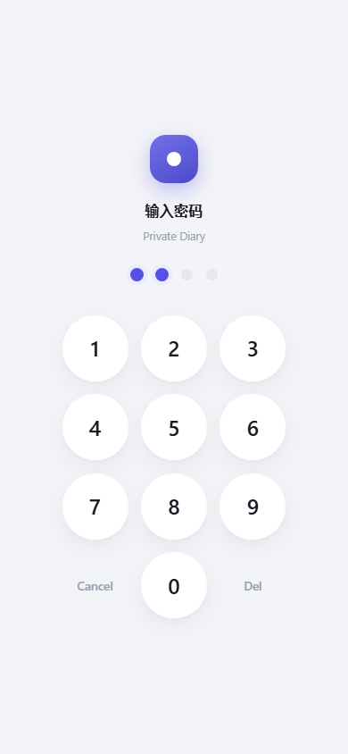 | 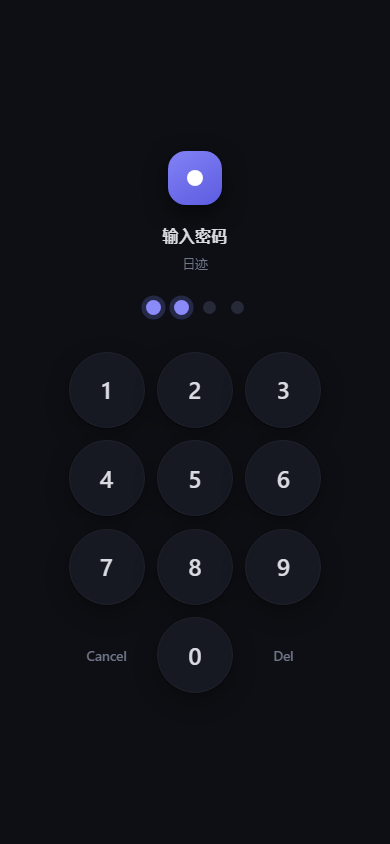 |

---

## Installation

### Option 1: Install on your phone (PWA — easiest)

1. Open **<https://wxk66.github.io/private-diary/>** in a mobile browser
2. Browser menu → "**Add to Home Screen**"
3. A "Private Diary" icon appears — tap to launch

It runs as a standalone full-screen window with no address bar, and **works offline**.

> That URL only delivers the page — it **never receives or stores any records**.
> Everything stays in your own phone's local storage. Prefer not to use a public
> URL? Serve it yourself as shown in Option 3.
>
> Note: opening `app/index.html` directly over `file://` won't register the service
> worker, so offline mode won't work — it must be served over HTTP(S).

### Option 2: Install the APK

Download `private-diary-v1.2.0.apk` (~80 KB) from [Releases](../../releases),
or use `app/android/dist/private-diary-v1.2.0.apk` from the repo.

1. Transfer the APK to your phone (USB cable, or any file-transfer app)
2. Tap to install; Android will ask you to allow installs from unknown sources
3. A "Private Diary" icon appears — tap to launch, no network needed

```bash
adb install -r "app/android/dist/private-diary-v1.2.0.apk"
```

> The APK is a minimal WebView shell; all business logic lives in the web page.
> It requests **no network and no storage permission**. Only two permissions are declared:
> `POST_NOTIFICATIONS` (and only prompted when you actually enable the daily reminder) and
> `RECEIVE_BOOT_COMPLETED` (to restore the schedule after a reboot).

### Option 3: Run on desktop

```bash
cd app
python -m http.server 8777 --bind 127.0.0.1
# then open http://127.0.0.1:8777/index.html
```

---

## Usage examples

### Log an entry

```
Calendar → "+ Add entry"
        → pick type "Ejaculation"
        → enter amount 2.5 (optional)
        → time defaults to now; note is optional
        → select triggers "Stressed" and "Can't sleep"
        → Save
```

Or faster: **long-press today's cell** to log one with the last used type.

### Backfill yesterday

```
Calendar → tap yesterday's cell
        → "＋ Add an entry for this day" at the bottom of the day panel
        → change the time, pick a type, save
```

### Read the trends

```
Stats → Goals: 8 this week vs a limit of 3 — over, 0 weeks on target
      → Last 12 months: the line shows which months ran high
      → By trigger: Stressed appears most, 21 times
      → Details → Rhythm: longest streak 5 days
```

### Backup and restore

Settings → "Export backup (JSON)":

- Web: downloads `private-diary-YYYY-MM-DD.json`
- APK: opens the system "Save to…" dialog so you pick the location (via SAF, no storage permission)

"Restore from backup" **overwrites** all current entries (with confirmation) and preserves
your current passcode settings.

> Export a backup from time to time. **Clearing browser data deletes your entries too**,
> and that can't be undone.

---

## Configuration

Everything is configured in the in-app Settings page — no config files, no code changes:

| Group | Setting | Default |
|---|---|---|
| Appearance | Theme | Follow system |
| Appearance | Language | Follow system |
| Appearance | Week starts on | Monday |
| Privacy | Passcode lock (4 digits) | Off |
| Frequency reminders | Enable reminders | On |
| Frequency reminders | Weekly limit | 3 |
| Frequency reminders | Monthly limit | 10 |
| Daily reminder | Daily check-in | Off |
| Daily reminder | Reminder time | 21:00 |

### Data format

Data lives in the browser/WebView **localStorage** under the key `private-diary.v1`:

```jsonc
{
  "version": 2,
  "records": {
    "2026-09-26": [
      {
        "id": "m3k9x2a",        // unique id
        "t": "13:41",           // time HH:MM
        "k": "ej",              // type ej|fl|other; missing = "Unclassified"
        "v": 1.6,               // amount in mL (optional; missing = not measured)
        "n": "note",            // free-text note (optional)
        "g": ["stress","bored"] // trigger tag ids (optional)
      }
    ]
  },
  "settings": {
    "theme": "system",          // system | light | dark
    "lang": "system",           // system | zh | en
    "weekStart": 1,             // 0 Sunday / 1 Monday
    "pin": "p2:120000:9f3c…",   // PBKDF2-SHA256 derivation; empty = no passcode
    "pinSalt": "a1b2c3…",       // 16-byte random salt (hex)
    "pinIter": 120000,          // iteration count
    "pinFails": { "n": 0, "until": 0 },  // failure count and unlock timestamp
    "lastKind": "ej",
    "lastTags": ["stress"],     // tags pre-selected on the next new entry
    "remind": { "on": true, "week": 3, "month": 10 },
    "remindDismiss": {},        // per-period "dismissed" markers
    "daily": { "on": false, "time": "21:00" }
  }
}
```

**Compatibility**: records without a `k` field always display as "Unclassified" and are never
rewritten. A missing `v` means not measured; a missing `g` means no tags.
Passcodes from older versions used a DJB2 hash — they still unlock, and Settings will prompt
you to reset for PBKDF2. The legacy storage key `dyf.tracker.v1` is read once and migrated
to the new key automatically.

---

## Privacy & data

- Everything is stored in the browser/WebView **localStorage** under the key `private-diary.v1`
- The app makes **no network requests at all**; the APK requests no network permission, and
  there is no `fetch` / `XMLHttpRequest` anywhere in the code
- No account, no telemetry, no crash reporting
- The passcode is stored only as a PBKDF2 derivation plus a random salt — never in plaintext
- Uninstalling the app or clearing site data deletes your entries, so **export a backup regularly**

---

## Project structure

```
private-diary/
├─ README.md / README-en.md      docs (Chinese / English)
├─ LICENSE                       MIT
├─ app/
│  ├─ index.html                 everything (single file, zero dependencies, ~2500 lines)
│  ├─ manifest.webmanifest       PWA install config
│  ├─ sw.js                      offline caching service worker
│  ├─ icon-192.png / icon-512.png / apple-touch-icon.png / favicon.png
│  ├─ preview/                   screenshots
│  ├─ tools/                     dev tooling (not bundled into the APK)
│  │  ├─ cdp.js                  minimal CDP client (Node 22 built-in WebSocket, no deps)
│  │  ├─ verify.js               one-shot verification: e2e tests + layout checks
│  │  ├─ check-circle.js         passcode keypad shape/overflow check
│  │  ├─ build-tests.js          generates test pages and demo-data pages
│  │  ├─ _e2e.js                 end-to-end test suite (~220 assertions)
│  │  ├─ shots.js                regenerates preview/ screenshots (both languages)
│  │  └─ gen-icons.js            generates app icons and the monochrome notification icon
│  └─ android/                   APK build project (see app/android/README.md)
└─ .gitignore
```

---

## Development

The app itself is a **single file with zero dependencies**: `app/index.html` contains the markup,
styles and logic together. There is no build step — edit and refresh.

### Running the checks

Start a static server in `app/`, then:

```bash
node tools/verify.js            # everything
node tools/verify.js --e2e      # only the end-to-end interaction tests
node tools/verify.js --layout   # only the layout/adaptation checks
node tools/check-circle.js      # only the passcode keypad shape check
node tools/shots.js             # regenerate preview/ screenshots
```

Verification drives the system's built-in Edge/Chrome in **headless mode over
CDP (Chrome DevTools Protocol)** — a real browser, real layout, real interaction,
not static analysis.

`tools/verify.js` runs two kinds of checks:

1. **End-to-end interaction tests** (~220 assertions) — injects `tools/_e2e.js` into a copy of
   `index.html` and clicks buttons, fills forms, switches views, toggles the passcode lock,
   switches languages, and verifies data persistence and reloads in a real browser,
   while counting page JS errors.
2. **Layout checks** (12 viewport sizes) — horizontal overflow, calendar column 7 overflow,
   bottom nav occlusion, entry-sheet button reachability, touch target heights,
   and whether the passcode keypad is circular and fits.

### Rebuilding the APK

```bash
python app/android/build.py       # output in app/android/dist/
python app/android/verify-apk.py  # 28 self-checks
```

The build chain is `aapt2 → javac → d8 → zipalign → apksigner`, with no Gradle.
**JDK 17 is required** (R8/d8 8.2.2 is incompatible with JDK 21+); see `app/android/README.md`.

---

## FAQ

**Does my data get uploaded anywhere?**
No. The app makes **no network requests at all**, and the APK requests no network permission.
Everything stays on your device.

**How do I move to a new phone?**
Settings → Export backup → transfer the JSON → Restore from backup.
Note that the browser version and the APK have separate storage, so cross-install migration
uses the same flow.

**I forgot my passcode.**
There is no backdoor in a client-side lock. You can clear the app data to reset it, but
**your entries will be lost with it** — which is why exporting a backup now and then is worth it.

**Why does the APK need notification permission?**
Only for the daily check-in reminder, and it is **only requested when you actually turn that
feature on**. Leave it off and the app never asks.

**Why doesn't the daily reminder fire in the web version?**
Web pages have no background execution. It only works while the page is open.
Install the APK if you want it to fire with the app closed.

---

## Known limitations

- **The passcode lock is client-side.** It stops someone who casually picks up your phone, but
  not someone who can clear the app's data. A 4-digit passcode is only 10,000 combinations;
  PBKDF2 with a salt raises the cost of offline brute force but doesn't change the order of
  magnitude. The threat model is "someone else has my phone" — so don't use your birthday.
- **The APK uses an inexact alarm** (`setInexactRepeating`) for the daily reminder, so it can
  fire a few minutes off. In exchange, it needs no `SCHEDULE_EXACT_ALARM` permission.
- **The APK package name is still `com.wxk.riji`.** Changing it would make Android treat it as a
  different app, breaking in-place upgrades, so it was deliberately kept. The name users see
  comes from `strings.xml` and is already "私密日志".

---

## License

[MIT](LICENSE) © 2026 wxk66
