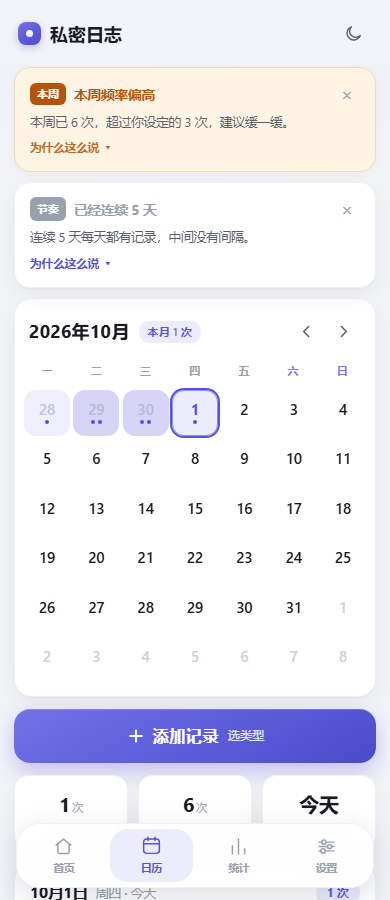
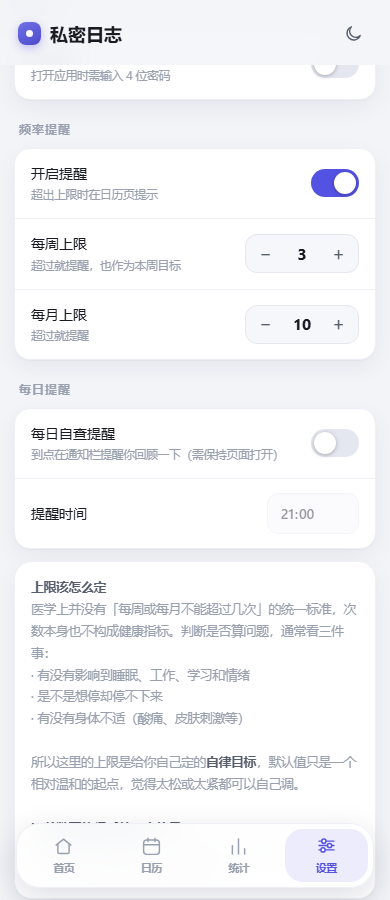
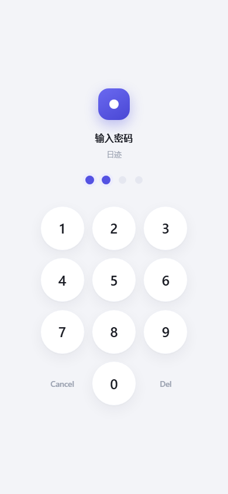

中文 | [English](README-en.md)

# 私密日志

> 一个完全离线的日历式私密记录工具。数据只存在你自己的设备上，不联网、无账号、不上传。

[](LICENSE)
[](#安装与使用)
[](#隐私与数据)
[](#配置说明)

「私密日志」用日历的形态记录每天的次数与类型，把长期趋势、诱因分布、频率提醒和自律目标放在统计页。
提供两种使用方式：**手机浏览器安装的 PWA**，以及**可安装的 Android APK**（带真正的每日提醒通知）。

<p align="center">
  
  
  
</p>

---

## ⚠️ 先读这一段

**这个应用不是医疗建议，也不构成健康诊断。**

关于频率，医学上并没有「每周或每月不能超过几次」的统一标准，次数本身并不构成健康指标。
临床上判断是否构成问题，通常看的是另外三件事：

- 有没有影响到睡眠、工作、学习和情绪
- 是不是想停却停不下来
- 有没有身体不适（酸痛、皮肤刺激等）

所以应用里的「每周上限 / 每月上限」被定位成**你自己定的自律目标**，而不是医学红线，
默认值只是一个相对温和的起点，随时可以调整。提醒文案也是按这个口径写的——
陈述事实 + 指路，而不是下断言。

如果你觉得这件事正在影响生活，值得聊一聊的对象是医生或心理咨询师，而不是一个 App。

---

## 功能特性

### 📅 日历页

- 月视图，42 格，支持「每周起始日」为周一或周日
- 每天的格子**按次数深浅着色**（1~4 级），超过 4 次直接显示数字
- 格子下方的小圆点**按类型着色**，一眼看出那天是哪种类型
- 点击任意日期查看当天详情，可以**为历史日期补记**
- **长按任意日期**即可按上次的类型快速记一次，不用打开表单
- 迷你统计：本月次数 / 本周次数 / 距上次

### ✍️ 记录

点「添加记录」弹出表单：

| 字段 | 说明 |
|---|---|
| **类型** | 射精 / 流精 / 其他，各带配色圆点 |
| **精液量** | 选「射精」或「流精」时才展开，单位 mL，可留空表示未测量，带「清除」按钮 |
| **时间** | 默认当前时间，可改 |
| **备注** | 自由文本 |
| **诱因 / 状态** | 多选：压力大、无聊、睡不着、独处、刷到内容、习惯性、疲惫、焦虑 |

表单会**记住上次选的类型和标签**，所以日常记录通常就是「添加记录 → 保存」两步。
删除有二次确认，删掉之后**底部提示条上会出现「撤销」**，6 秒内点它就能恢复。

### 📊 统计页

- **总览**：本月次数（含较上月涨跌）、本周次数、距上次、累计次数
- **目标达成**：本周/本月进度条、是否在目标内、**连续达标周数**
- **最近 30 天**：柱状图，一眼看出节奏
- **最近 12 个月**：折线图 + 面积填充，标出最高点与当前月
- **近半年热力图**：26 周 × 7 天
- **类型分布** / **诱因分布**：各类占比与次数
- **详细数据**：按「节奏 / 频率与测量 / 时间线」分三组的 11 项指标

### 🔔 频率提醒

超出上限时在日历页顶部给出提醒卡片，可以点开看详情，也可以按周期单独关闭
（关掉本周的，下周会自动重新出现，不会永久静音）。

| 规则 | 默认阈值 | 级别 |
|---|---|---|
| 本月次数超过月上限 | 10 次 | 警示 |
| 本周次数超过周上限 | 3 次 | 警示 |
| 连续每天都有记录 | ≥ 3 天 | 提示 |
| 本月深夜时段（0:00–5:00） | ≥ 3 次 | 提示 |

后两条是刻意加的：**连续天数**和**深夜时段**比单月总数更能反映习惯是否在失控，
而睡眠不足带来的影响通常比次数本身更明显。

### ⏰ 每日自查提醒

在设置里开启并选定时间，到点提醒你回顾一下状态（文案刻意写成「自查」而不是「该记录了」——
这个应用的目的不是催你多做）。

- **APK 版**：用系统的 `AlarmManager` + 通知栏，**关掉应用也会提醒**，重启后自动恢复
- **网页版**：没有后台能力，只在页面打开着的时候到点弹系统通知

### 🔒 隐私锁

- 4 位数字密码，打开应用时需输入
- 密码用 **PBKDF2-SHA256（12 万次迭代 + 随机盐）** 派生后存储，不保存明文
- **连续输错 5 次开始锁定**，从 30 秒起逐次翻倍（最多约 32 分钟），期间有倒计时
- 键盘按键在任何屏幕尺寸与宽高比下都保持正圆

### 🌐 界面语言

完整支持**中文 / English**，设置里可切换，也可以跟随系统语言。
切换是即时生效的，不需要重装或刷新。

---

## 界面预览

**中文界面**

| 日历 | 统计 | 记录表单 | 深色主题 |
|:---:|:---:|:---:|:---:|
|  |  |  |  |

| 频率提醒 | 设置页 | 隐私锁 | 隐私锁（深色） |
|:---:|:---:|:---:|:---:|
|  |  |  |  |

**English UI**

| Calendar | Stats | Entry form |
|:---:|:---:|:---:|
|  |  |  |

---

## 安装与使用

### 方式一：装到手机上（PWA，最省事）

1. 用手机浏览器打开 **<https://wxk66.github.io/private-diary/>**
2. 浏览器菜单 →「**添加到主屏幕**」
3. 桌面出现「私密日志」图标，点开即用

装好后是全屏无地址栏的独立窗口，**离线也能打开**。

> 这个网址只负责把网页送过来，**不接收也不保存任何记录**——所有数据仍然只写在
> 你自己手机的本地存储里。不想用公网地址的话，见下方「方式三」自己起服务。
>
> 注意：直接双击 `app/index.html` 用 `file://` 打开时 Service Worker 无法注册，
> 离线功能不可用，必须通过 HTTP(S) 访问。

### 方式二：安装 APK

从 [Releases](../../releases) 下载 `private-diary-v1.2.0.apk`（约 80 KB），
或直接用仓库里的 `app/android/dist/private-diary-v1.2.0.apk`。

1. 把 APK 传到手机（数据线 / 微信文件传输助手都行）
2. 手机上点击安装，首次会提示「允许安装未知来源应用」，同意即可
3. 桌面出现「私密日志」图标，点开即用，无需联网

```bash
adb install -r "app/android/dist/private-diary-v1.2.0.apk"
```

> APK 是一个最小 WebView 外壳，业务逻辑全在网页里。
> **不申请联网、不申请存储权限**；只声明两个权限：
> `POST_NOTIFICATIONS`（且只在你真的开启每日提醒时才弹窗请求）和
> `RECEIVE_BOOT_COMPLETED`（重启后恢复定时）。

### 方式三：在电脑上打开

```bash
cd app
python -m http.server 8777 --bind 127.0.0.1
# 然后浏览器打开 http://127.0.0.1:8777/index.html
```

---

## 使用示例

### 记录一次

```
日历页 →「+ 添加记录」
      → 选类型「射精」
      → 填精液量 2.5（可留空）
      → 时间默认当前，备注可写可不写
      → 选两个诱因标签「压力大」「睡不着」
      → 保存
```

或者更快：**长按日历上今天的格子**，直接按上次的类型记一次。

### 补记昨天

```
日历页 → 点昨天那一格
      → 日期详情底部「+ 为这一天补记一次」
      → 改时间、选类型、保存
```

### 看趋势

```
统计页 → 目标达成：本周 8 次 / 上限 3 次，已经超出，连续达标 0 周
      → 最近 12 个月：折线能看出哪几个月明显偏高
      → 诱因分布：压力大 21 次最多
      → 详细数据 → 节奏：最长连续记录 5 天
```

### 备份与恢复

设置页 →「导出备份（JSON）」：

- 浏览器版：直接下载 `private-diary-YYYY-MM-DD.json`
- APK 版：弹出系统的「保存到…」界面，你自己选位置（走 SAF，不需要存储权限）

「从备份恢复」会**覆盖**当前全部记录（有二次确认），导入时会保留你当前的隐私锁设置。

> 建议隔一段时间导出一次。**清除浏览器数据会连记录一起删掉**，且无法恢复。

---

## 配置说明

所有配置都在应用内的「设置」页，无需改代码或配置文件：

| 分类 | 设置项 | 默认值 |
|---|---|---|
| 外观 | 主题 | 跟随系统 |
| 外观 | 语言 | 跟随系统 |
| 外观 | 每周起始日 | 星期一 |
| 隐私 | 隐私锁（4 位数字） | 关闭 |
| 频率提醒 | 开启提醒 | 开启 |
| 频率提醒 | 每周上限 | 3 次 |
| 频率提醒 | 每月上限 | 10 次 |
| 每日提醒 | 每日自查提醒 | 关闭 |
| 每日提醒 | 提醒时间 | 21:00 |

### 数据格式

数据存在浏览器/WebView 的 **localStorage** 里，键名 `private-diary.v1`：

```jsonc
{
  "version": 2,
  "records": {
    "2026-09-26": [
      {
        "id": "m3k9x2a",        // 唯一 id
        "t": "13:41",           // 时间 HH:MM
        "k": "ej",              // 类型 ej|fl|other，缺失表示「未分类」
        "v": 1.6,               // 精液量 mL（可选，缺失表示未测量）
        "n": "备注",             // 备注（可选）
        "g": ["stress","bored"] // 诱因标签 id 数组（可选）
      }
    ]
  },
  "settings": {
    "theme": "system",          // system | light | dark
    "lang": "system",           // system | zh | en
    "weekStart": 1,             // 0 周日 / 1 周一
    "pin": "p2:120000:9f3c…",   // PBKDF2-SHA256 派生结果，空串表示未开启
    "pinSalt": "a1b2c3…",       // 16 字节随机盐（十六进制）
    "pinIter": 120000,          // 迭代次数
    "pinFails": { "n": 0, "until": 0 },  // 连续输错次数与解锁时间
    "lastKind": "ej",
    "lastTags": ["stress"],     // 下次新增时默认带上的标签
    "remind": { "on": true, "week": 3, "month": 10 },
    "remindDismiss": {},        // 按周期记录的"已关闭"提醒
    "daily": { "on": false, "time": "21:00" }
  }
}
```

**兼容性**：没有 `k` 字段的历史记录一律显示为「未分类」，不会被自动改写；
没有 `v` 表示未测量；没有 `g` 表示没打标签。
更早版本的密码是 DJB2 哈希，仍能解锁，设置页会提示你重设以启用 PBKDF2。
旧版本的存储键 `dyf.tracker.v1` 会被自动读取并迁移到新键。

---

## 隐私与数据

- 所有数据只存在本机，存储结构见上文[数据格式](#数据格式)
- 应用**没有任何网络请求**，APK 也不申请联网权限，代码里没有 `fetch` / `XMLHttpRequest`
- 没有账号、没有遥测、没有崩溃上报
- 隐私锁的密码只保存 PBKDF2 派生结果和随机盐，不保存明文
- 卸载应用或在浏览器里清除站点数据 = 记录被删除，所以**定期导出备份**

---

## 常见问题

**Q：数据会上传到服务器吗？**
不会。应用**没有任何网络请求**，APK 也不申请联网权限。所有数据只在本机。

**Q：换手机怎么迁移？**
设置页「导出备份」→ 把 JSON 文件传到新手机 → 「从备份恢复」。
注意浏览器版和 APK 版的存储是独立的，跨端迁移也走这个流程。

**Q：忘记隐私锁密码了怎么办？**
客户端密码锁没有后门。可以清除应用数据重置，但**记录会一起丢失**——
所以还是定期导出备份比较稳妥。

**Q：为什么 APK 要申请通知权限？**
只有「每日自查提醒」需要。而且**只在你真的去开这个功能时才会弹窗请求**，
不开就一直不请求。

**Q：网页版的每日提醒为什么不响？**
网页没有后台能力，只有页面开着的时候才有效。想要关掉应用也能提醒，请用 APK 版。

---

## 已知限制

- **隐私锁是客户端的**：能挡住随手拿到手机的人，但挡不住能清除应用数据的对手。
  4 位数字密码本身也只有 1 万种组合，PBKDF2 加盐拉伸能提高离线爆破成本，但改变不了这个量级。
  真正的威胁模型是「手机被别人拿到」，所以别把密码设成生日。
- **APK 的通知提醒用的是非精确闹钟**（`setInexactRepeating`），
  实际触发时间可能有几分钟偏差——换来的是不需要 `SCHEDULE_EXACT_ALARM` 这个敏感权限。

---

## 项目结构

```
private-diary/
├─ README.md / README-en.md      中英文文档
├─ LICENSE                       MIT
├─ index.html                    GitHub Pages 入口（跳转到 app/index.html）
├─ .nojekyll                     让 Pages 跳过 Jekyll 处理
├─ app/
│  ├─ index.html                 全部功能（单文件，零依赖，约 2500 行）
│  ├─ manifest.webmanifest       PWA 安装配置
│  ├─ sw.js                      离线缓存 Service Worker
│  ├─ icon-192.png / icon-512.png / apple-touch-icon.png / favicon.png
│  ├─ preview/                   界面截图
│  ├─ tools/                     开发工具（不打进 APK）
│  │  ├─ cdp.js                  极简 CDP 客户端（Node 22 内置 WebSocket，零依赖）
│  │  ├─ verify.js               一键验证：端到端测试 + 布局适配检查
│  │  ├─ check-circle.js         隐私锁按键形状与溢出专项检查
│  │  ├─ build-tests.js          生成测试页与演示数据页
│  │  ├─ _e2e.js                 端到端测试用例（约 220 项断言）
│  │  ├─ shots.js                生成 preview/ 下的截图（中英双语）
│  │  └─ gen-icons.js            生成应用图标与通知栏单色图标
│  └─ android/                   APK 打包工程（详见 app/android/README.md）
├─ .gitattributes                统一换行符
└─ .gitignore
```

> **网页版怎么上线的**：仓库开了 GitHub Pages，源设为 `main` 分支根目录。
> 所以往 `main` 推一次代码，站点就自动重新构建，不需要额外的工作流文件。
> 根目录的 `index.html` 只是给 Pages 一个干净入口，真正的应用一直在 `app/` 下。

---

## 开发

应用本身是**单文件、零依赖**的：`app/index.html` 里同时包含结构、样式和逻辑，
没有任何构建步骤，改完直接刷新即可。

### 跑验证

需要先在 `app/` 目录起一个静态服务，然后：

```bash
node tools/verify.js            # 全部检查
node tools/verify.js --e2e      # 只跑端到端交互测试
node tools/verify.js --layout   # 只跑布局适配检查
node tools/check-circle.js      # 只查隐私锁按键形状
node tools/shots.js             # 重新生成 preview/ 截图
```

验证方式：用系统自带的 Edge/Chrome 以**无头模式**启动，通过
**CDP（Chrome DevTools Protocol）**驱动——真实浏览器、真实布局、真实交互，不是静态分析。

`tools/verify.js` 会做两类检查：

1. **端到端交互测试**（约 220 项断言）——把 `tools/_e2e.js` 注入 `index.html` 的副本，
   在真实浏览器里点按钮、填表单、切页面、开关隐私锁、切换语言、
   验证数据落盘与重载，并统计页面 JS 报错数。
2. **布局适配检查**（12 种屏幕尺寸）——横向溢出、日历第 7 列越界、
   底部导航遮挡内容、记录弹层按钮可达性、触控目标高度、
   以及隐私锁键盘是否正圆且放得下。

### 重新打包 APK

```bash
python app/android/build.py       # 产物在 app/android/dist/
python app/android/verify-apk.py  # 28 项自检
```

打包链是 `aapt2 → javac → d8 → zipalign → apksigner`，不走 Gradle。
**必须用 JDK 17**（R8/d8 8.2.2 与 JDK 21+ 不兼容），细节见 `app/android/README.md`。

---

## 致谢

感谢 [linux.do](https://linux.do) 社区为本项目提供的支持与帮助。

---

## 许可证

[MIT](LICENSE) © 2026 wxk66
